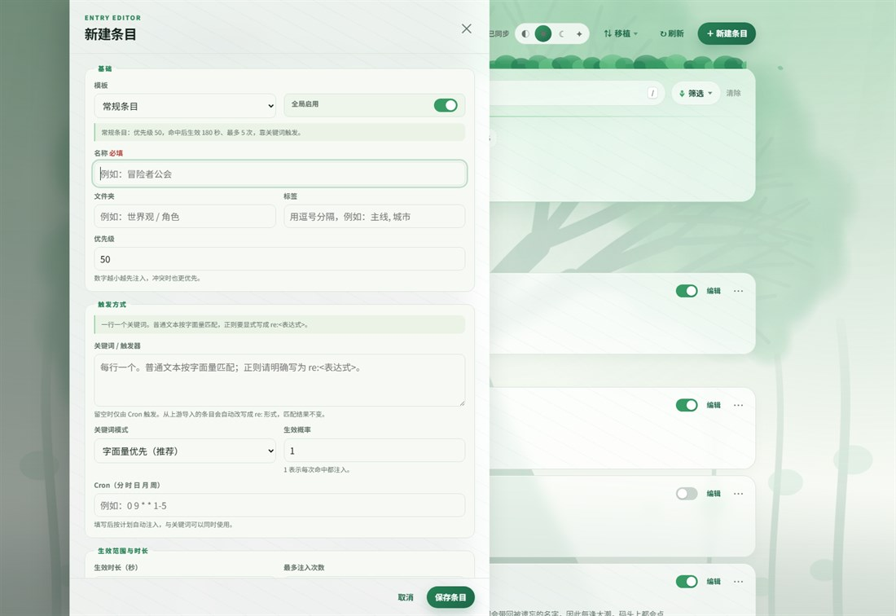

# 世界树


**世界树（WorldTree Lore）** 是 AstrBot 的动态世界书插件。把世界观、角色设定和长期规则拆成一条条「条目」存起来，插件会在对话时按关键词、适用范围或定时规则挑出相关的那几条，临时注入这一轮的模型请求。

设定因此只在需要时出现：不必把所有背景塞进人格提示词，也不会长期占着上下文。

> 本项目基于 [Zhalslar/astrbot_plugin_worldbook](https://github.com/Zhalslar/astrbot_plugin_worldbook) 的思路独立衍生重构，不是上游的官方版本。致谢与许可见[文末](#致谢与许可)和 [NOTICE.md](NOTICE.md)。


## 目录

- [为什么再做一个](#为什么再做一个)
- [安装](#安装)
- [快速上手](#快速上手)
- [条目是怎么生效的](#条目是怎么生效的)
- [管理台](#管理台)
- [聊天命令](#聊天命令)
- [从上游 Worldbook 迁移](#从上游-worldbook-迁移)
- 参考：[七种条目模板](#七种条目模板) · [角色条目与模型覆盖](#角色条目与模型覆盖) · [关键词写法](#关键词写法) · [适用范围](#适用范围) · [Cron 规则](#cron-规则) · [内容占位符](#内容占位符) · [插件配置](#插件配置)
- [常见问题](#常见问题)
- [数据与安全](#数据与安全)
- [开发与自查](#开发与自查)
- [致谢与许可](#致谢与许可)

## 为什么再做一个

世界书本身很好用，但条目一多就难维护——它们都躺在插件配置项的列表里，想改一条得逐个展开去找。

世界树把条目管理搬进插件自带的网页管理台，围绕四件事重做：

- **找得到**：搜名称、正文、标签、文件夹、关键词和适用范围。搜索与分页都在后端完成，条目上千也不用逐个展开。
- **看得清**：列表里直接显示模板徽章、优先级、启用状态、触发器数量和内容摘要，七种排序还会自动生成分组标题。
- **改得动**：勾选后批量启用、停用、换文件夹、增删标签或删除。多个页面同时编辑时用修订号防覆盖。
- **搬得走**：JSON / YAML 导入导出，兼容上游 Worldbook 与常见世界书字段。

条目不是只能在管理台里改，一共四个入口：

| 入口 | 适合做什么 |
| --- | --- |
| [世界树管理台](#管理台) | 完整字段编辑、检索、筛选、批量操作、导入导出。功能最全。 |
| [聊天命令](#聊天命令) | 查找、查看、快速加一条、删除、开关，以及当前会话的固定与屏蔽。 |
| JSON / YAML 导入 | 批量创建或从别的世界书[迁移](#从上游-worldbook-迁移)。 |
| 模型写入工具 | 让模型替管理员记下长期规则。默认关闭，见[插件配置](#插件配置)。 |

插件名、命令组、数据目录、Web API 和工具名都是独立的，因此可以和上游插件同时装着，边对照边迁移。

## 安装

需要 AstrBot `>= 4.26.0, < 5`——管理台用到了该版本提供的 Plugin Pages 和 `astrbot.api.web`。Python 依赖 APScheduler 3.x 与 PyYAML 6.x，由 [requirements.txt](requirements.txt) 自动安装。

1. 在 AstrBot WebUI 的插件管理页安装本仓库，或上传 ZIP。
2. 等依赖装完后重载插件；必要时重启 AstrBot。
3. 打开「世界树」插件详情，点页面入口 **世界树管理台**。

## 快速上手

先建最常见的一种条目：提到某个词才补充设定。

1. 管理台右上角点 **新建条目**（或直接按 `N`）。
2. 模板保持「常规条目」，填名称，比如 `雾港`。
3. **关键词**一行一个，填 `雾港` 和 `旧码头`。普通文本按字面量匹配，不用操心正则转义。
4. **注入内容**写这条设定的正文。
5. `Ctrl+Enter` 保存。

此后任何提到「雾港」的消息，都会把这段正文附在当轮模型请求里，持续 180 秒或 5 次——这是常规模板的默认值，可以改。

想让某条设定每轮都带上，新建时选「常驻条目」模板就行，其它字段不用动。

要让机器人扮演一个角色，用「角色条目」模板，正文按角色卡写。它默认注入 system prompt，而且同一会话只留一个，详见[角色条目与模型覆盖](#角色条目与模型覆盖)。



## 条目是怎么生效的

```text
用户消息或 Cron → 关键词 / 范围 / 概率检查 → 在当前会话激活 → 按优先级和字符预算选择 → 注入本轮模型请求
```

激活是**按会话**算的：条目在某个群被触发，就只在那个群生效，直到时长用完、次数用完或插件重载。

| 字段 | 说明 |
| --- | --- |
| 全局启用 | 关掉后任何会话都不会激活它。 |
| 名称 | 条目的唯一名称，也是管理台和命令定位条目的依据。 |
| 文件夹 | 用于分类和筛选，不影响触发。 |
| 标签 | 用于检索、筛选和批量管理，不影响触发。 |
| 优先级 | 数字越小越先注入；字符预算不够时，低优先级的可能被跳过。 |
| 生效概率 | `0` 到 `1`，例如 `0.05` 就是 5%。 |
| 生效时长 | 激活后能持续多少秒；`0` 表示不限。 |
| 最多注入次数 | 本次激活后最多真正注入几次；`0` 表示不限。 |
| 关键词 | 一行一个。留空的条目只能靠 Cron 或管理员「固定」命令激活。 |
| Cron | 标准五段：`分 时 日 月 周`。 |
| 适用范围 | 限定管理员、用户、群聊或具体会话；留空表示不限。 |
| 注入内容 | 条目生效后交给模型参考的正文。 |
| 模型名 / 提供商 ID | 可选。只在条目生效期间临时改用别的模型或提供商，见[给单个条目指定模型](#给单个条目指定模型)。 |

两个容易踩的点：

- 重复命中同一条目**不会**刷新它的剩余时长或次数。上游会刷新，结果是高频关键词的条目实际永不过期。
- 注入默认走本轮临时用户上下文，不写进聊天历史。需要 system 层级优先级时可在[插件配置](#插件配置)里改。

## 管理台

顶部是一条「树冠工具带」，搜索、概览、筛选、排序和视图开关都在上面；条目列表沿主干居中展开。

- **搜索**：多个词按「全部包含」处理。搜 `雾港 主线` 只返回同时含这两个词的条目。匹配范围包括名称、正文、文件夹、标签、关键词和适用范围。
- **概览标签**：中间的年轮总数和旁边的叶片标签本身就是筛选按钮，点一下即切到对应视图（文件夹数量只作展示）。
- **筛选**：状态、模板、文件夹、标签默认收起，按钮上会显示当前生效的条件数量。
- **排序**：优先级由小到大 / 由大到小、条目类型、文件夹、名称、最近更新、启用状态，共七种。切换后列表会按该维度生成分组标题。
- **批量**：勾选条目或点「选择本页」后出现批量工具栏，可启用、停用、移动文件夹、增删标签、把关键词转为新模式、导出所选或删除。
- **移植**：工具带上的「移植」菜单里是导入世界书、导出 YAML / JSON 备份。也可以把 JSON 文件直接拖到页面上。
- **主题**：右上角四档——跟随 AstrBot、白昼、暗林、荧夜，选择记在本地浏览器里。紧凑视图和「收起全部」在视图那一行。
- **快捷键**：`/` 聚焦搜索，`N` 新建条目，`Ctrl+Enter` 保存，`Esc` 关掉当前弹层。

想以现有条目为蓝本，用「复制为新条目」派生一份再改。删除会弹页内确认框，但管理台里没有回收站，删之前建议先导出。


## 聊天命令

命令都挂在独立的 `世界树` 命令组下（别名 `worldtree`、`世界树书`），除帮助外都限管理员。实际前缀取决于 AstrBot 的全局命令配置。

| 命令 | 作用 |
| --- | --- |
| `世界树 帮助` | 简要帮助。别名 `help`。 |
| `世界树 查找 <关键词>` | 搜名称、正文、标签、文件夹、关键词和范围。别名 `搜索`。 |
| `世界树 查看 <名称>` | 看一个条目的完整设置和正文。 |
| `世界树 添加 <单词名称> <内容>` | 快速加一条常规条目，名称同时作为默认关键词。 |
| `世界树 删除 <名称>` | 删除全局条目。 |
| `世界树 全局开关 <名称> <开或关>` | 改全局启用状态。别名 `开关`。 |
| `世界树 固定 <名称>` | 只在当前会话立刻激活它。 |
| `世界树 终止 [名称或模板]` | 立刻结束当前会话里生效中的条目。不带参数结束全部，也可以只写一个条目名或模板名（如 `常规`、`角色`）。别名 `停止`、`熄灭`。 |
| `世界树 屏蔽 <名称>` | 只在当前会话屏蔽它。 |
| `世界树 解除屏蔽 <名称>` | 取消当前会话的屏蔽。 |
| `世界树 会话状态` | 查看当前会话的激活与屏蔽情况。 |
| `世界树 清理` | 清掉当前会话的激活条目。 |
| `世界树 清理 全部` | 连临时屏蔽一起清掉。 |

「固定」和「屏蔽」只改当前会话的临时状态，不会写回全局的 `scope`；插件重载后这些运行态会清空。

**「终止」和「屏蔽」不是一回事。** 条目命中之后会持续一段时间（常规条目默认 180 秒或 5 次），「终止」就是提前把这段生效期掐掉，让它当场退场。但条目本身仍然启用，下一条消息再次命中还会回来——`re:.*` 这类全量触发的条目几乎是立刻回来，所以命令回复里会专门提醒。想在这次对话里彻底挡住它，用「屏蔽」。

文件夹、标签、优先级、概率、时长、次数、关键词模式、Cron、适用范围这些字段的交互式编辑，请在[管理台](#管理台)里做。

## 从上游 Worldbook 迁移

1. 在上游插件里执行 `导出世界书`，拿到 JSON / YAML / YML 文件。
2. 打开管理台，「移植」→「导入世界书」，选同名条目策略：**跳过**（保留现有条目，最安全）、**自动重命名**（两者都留，导入项变成 `名称 (2)`）、**覆盖**。
3. 导入后搜一下、抽查关键词模式、适用范围和 Cron。导入摘要会说明有多少条目的关键词被改写成了 `re:` 形式。

限制：单个文件最大 2 MiB，单次最多处理 2000 个条目，文件必须是 UTF-8。

除本插件和上游格式外，导入器也认常见世界书字段：`entries` / `world_info`、`comment` / `name`、`key` / `keys` / `keywords`、`order` / `insertion_order` / `priority`、`disable` / `enabled`、`content`。各家世界书的高级语义并不完全一致，导入成功不等于行为百分之百等价，建议先备份再抽查关键条目。

### 和上游不一样的地方

- 关键词默认按字面量匹配，正则必须显式写 `re:`。导入时会自动补前缀，详见[关键词写法](#关键词写法)。
- 「固定 / 屏蔽」只改当前会话的临时状态，不再靠改写全局 `scope` 来模拟。
- 重复命中不会重置已激活条目的时长和剩余次数。
- 被某个会话屏蔽的 Cron 条目，不会消耗其他会话本可接收的待激活信号。
- 星期字段按标准 crontab 语义转换。
- 会话运行态不落盘，重载后不会带着陈旧的剩余次数或屏蔽状态。
- 导入大小、条目数量、字段长度、注入条数和字符预算都有上限。

完整改动记录见 [CHANGELOG.md](CHANGELOG.md)。

### 和上游插件共存

关键标识符都不复用，所以两个插件可以先并行装着，导入、核对之后再决定是否停用旧的。世界树不会读取或修改上游插件的数据。

| 类型 | 世界树 |
| --- | --- |
| 插件包名 | `astrbot_plugin_worldtree_lore` |
| 插件类 | `WorldTreeLorePlugin` |
| 命令组 | `世界树` / `worldtree` |
| Web API 前缀 | `/astrbot_plugin_worldtree_lore` |
| LLM 工具 | `worldtree_lore_add_entry` |
| 数据目录 | `astrbot_plugin_worldtree_lore` 独立目录 |

## 七种条目模板

模板只做两件事：新建条目时填一套预设值，以及给条目一个可筛选、可排序的分类徽章。它不是七条独立的注入通道——七种模板共用同一套字段和同一套判定逻辑，所以任何条目都能再手动改成别的行为。

| 模板 | 预设优先级 | 预设关键词 | 生效时长 | 最多次数 | 典型用途 |
| --- | --- | --- | --- | --- | --- |
| 角色条目 | 5 | 空（自己填） | 1800 秒 | 不限 | 机器人要扮演的角色卡 |
| 常规条目 | 50 | 空（自己填） | 180 秒 | 5 次 | 提到某个词才需要补充的设定 |
| 常驻条目 | 10 | `re:.*` | 不限 | 不限 | 世界观底层设定，每轮都想带上 |
| 随机条目 | 30 | `re:.*` | 180 秒 | 1 次 | 概率触发的彩蛋，另配生效概率 |
| 日程条目 | 80 | 空 + Cron `0 0 * * *` | 86400 秒 | 不限 | 到点自动生效的时间设定 |
| 群聊限定 | 120 | `re:.*` | 不限 | 不限 | 只在某些群生效，另配适用范围 |
| 用户限定 | 150 | `re:.*` | 不限 | 不限 | 只对某些用户生效，另配适用范围 |

在编辑器里换模板只改分类，不会覆盖你已经填好的字段；确实想回到预设，点「套用该模板默认值」。

顺便解释一个常见疑问：**常驻条目为什么也要填触发方式？** 因为「常驻」正是用 `re:.*`（匹配任意消息）加上不限时长、不限次数拼出来的。条目只认两种激活信号——关键词命中或 Cron 窗口——所以清空关键词后，常驻条目就再也不会生效。

## 角色条目与模型覆盖

角色条目是酒馆式的「角色卡」：写清机器人是谁、怎么说话、有哪些禁忌。插件会把它单独包一层再注入，和当背景资料用的普通条目分开。判定逻辑没有变（关键词、适用范围、时长、次数都照旧），区别只有三处：

- 注入位置单独可配，默认 `system_prompt`，权重高于普通设定。想跟随通用注入位置就把「角色条目注入位置」设成 `follow`。
- 同一会话默认只保留一个角色条目，新的生效时自动结束旧的，避免两份人格互相打架。要让多份人设叠加，关掉「同一会话只保留一个角色条目」。
- 预设优先级 5，是七种模板里最靠前的，因此在字符预算里最不容易被挤掉。

角色条目的预设关键词是空的。想让它每轮都在，关键词写 `re:.*`；只想临时穿一次，用 `世界树 固定 <名称>` 换上，聊完 `世界树 终止` 脱下来。

### 给单个条目指定模型

条目编辑器里有一组「模型覆盖（可选）」字段，角色条目最常用到，但任何模板都能填：

| 字段 | 作用 |
| --- | --- |
| 模型名 | 替换本轮请求的模型名，需要当前提供商支持它。 |
| 提供商 ID | 整体换一个服务提供商，用 AstrBot 服务提供商列表里的那个 ID。 |

两项只在条目生效期间起作用，条目退场后自动回到 AstrBot 的默认设置，不改动全局配置。多个条目同时生效时，优先级最靠前（数值最小）的那个说了算。

这是为一个很具体的麻烦准备的：有些模型会把角色设定本身当成违规内容拦掉。同一张风格偏激的角色卡，Gemini 可能直接返回 `400 PROHIBITED_CONTENT`（`prompt_blocked`），换 DeepSeek 就一切正常，而报错不会告诉你是哪个词触发的。与其逐字删设定，或者为一个角色把全局模型换掉，不如给这一个条目单独指定一个宽松的提供商，其他对话照旧走默认。

管理台的「提供商 ID」输入框会从运行中的 AstrBot 拉取真实 ID 作候选，照选即可。填了不存在的 ID 时，插件写一条警告日志后继续用默认提供商，不会让这一轮请求失败。要整体关掉这个能力，关掉「允许条目切换模型或提供商」。

## 关键词写法

默认是「字面量优先」模式：一行一个词，按普通文本查找，`.`、`*`、`[` 不会被误当成正则语法。

```text
雾港
角色设定
```

要用正则就显式加 `re:` 前缀：

```text
re:雾港|旧码头
re:^角色设定\s*[:：]
```

所以常驻条目的关键词要写成 `re:.*` 而不是 `.*`——后者在字面量模式下只会去匹配字面的一个 `.` 加一个 `*`。

上游把每一行关键词都当正则，所以它的常驻条目关键词就是一个裸 `.*`。世界树导入时会逐行补上 `re:`，并把条目切到字面量优先模式。`re:.*` 编译出的正则和上游的 `.*` 完全相同，命中结果一模一样；改写只是让整个条目库只有一套约定——否则哪天你把某个条目的关键词模式从兼容模式切回默认，裸正则就会静默退化成字面量，条目悄悄失效。

从 v1.4.0 起，插件启动时也会对库里残留的旧模式条目做一次同样的改写（只做一次，之后你主动选择兼容模式的条目不会再被改动）。少数无法无损改写的条目（例如补上前缀会超出关键词长度上限）会留在兼容模式，卡片上标一枚「旧世界书正则」徽章。想手动处理，编辑器里有「改写为 re: 形式」按钮，批量操作里有「关键词转为新模式」。

> 正则由管理员负责。复杂或会灾难性回溯的表达式会拖慢匹配，普通关键词优先用字面量。

## 适用范围

一行一个，满足任意一项即可使用该条目；留空表示不限。

```text
admin
user:<用户 ID>
group:<群 ID>
session:<UMO>
```

为兼容旧文件，也接受直接写裸的用户 ID、群 ID 或 UMO。新条目建议用带前缀的明确写法。

## Cron 规则

标准五段表达式：`分 时 日 月 周`。

```text
0 9 * * 1-5
```

表示周一到周五每天 09:00 触发。星期字段遵循常见 crontab 约定：`0` 或 `7` 是星期日，`1` 是星期一。

到点后会打开一次待激活信号，由后续符合范围的模型请求接收。被当前会话临时屏蔽的条目不会抢走这个信号。

## 内容占位符

注入内容里可以用这几个占位符：

| 占位符 | 内容 |
| --- | --- |
| `{user_id}` | 当前发送者 ID |
| `{user_name}` | 当前发送者名称 |
| `{user}` | 名称与 ID 的组合 |
| `{time}` | 当前本地时间，`HH:MM:SS` |
| `{entry_name}` | 当前条目名称 |

未知占位符原样保留。这不是模板引擎：条目不能执行表达式、访问属性或调用函数。

## 插件配置

| 配置项 | 默认值 | 说明 |
| --- | ---: | --- |
| 单次最多注入条目数 | `6` | 按优先级从小到大选；设为 `0` 可临时停掉全部注入。 |
| 单次最多注入字符数 | `12000` | 超预算的低优先级条目会被跳过，不会截断正文。 |
| 注入位置 | `extra_user_content` | 本轮临时用户上下文；也可选 `system_prompt`。 |
| 允许同优先级共存 | `true` | 关掉后，新激活的同优先级条目会替换旧的。 |
| 角色条目注入位置 | `system_prompt` | 角色条目专用的注入位置；`follow` 表示跟随上面的「注入位置」。 |
| 同一会话只保留一个角色条目 | `true` | 新角色条目生效时结束上一个。关掉可让多份人设叠加。 |
| 允许条目切换模型或提供商 | `true` | 控制条目里的[模型覆盖](#给单个条目指定模型)是否生效，关掉即忽略这两个字段。 |
| 会话运行态保留分钟数 | `1440` | 清理长时间没动静的临时会话状态。 |
| 允许模型为管理员创建条目 | `false` | 控制下方的模型写入工具。 |

`extra_user_content` 用的是临时内容部件，只参与当前请求，不写入对话历史，也更有利于模型服务商的系统提示词缓存。只有确实需要 system 层级优先级时才建议换成 `system_prompt`。

**关于模型写入工具**：开启后，只有管理员发起的模型请求能看到 `worldtree_lore_add_entry` 工具——插件在请求阶段对非管理员隐藏它，工具真正执行时再查一次管理员权限。模型创建的条目会自动进「LLM 创建」文件夹并打上同名标签，方便集中搜索和人工复核。建议只在确实需要模型保存长期规则、偏好或摘要时开启，别把它当成无审核的自动记忆。

## 常见问题

**插件详情里没有「世界树管理台」**

确认 AstrBot 不低于 4.26.0；重载插件或重启 AstrBot；检查插件目录里有没有 `pages/worldtree/`；再看 AstrBot 日志有没有插件加载或依赖安装报错。

**条目没触发**

逐项排查：「全局启用」是否打开、正则是否漏了 `re:` 前缀、适用范围是否放行当前用户 / 群 / 会话、概率是否为 0、次数是否用完、时长是否已过。只配了 Cron 没有关键词的条目，要等下一次有效调度信号。

**保存时提示条目库已被更新**

说明另一个管理台页面、聊天命令或模型工具先改过条目。刷新列表、重新打开条目，确认最新内容后再保存。这个提示就是为了避免静默覆盖。

**从上游导入后，常驻条目的关键词变成了 `re:.*`**

正常结果。上游常驻条目的关键词本来就是 `.*`，只是上游把所有关键词都当正则；世界树默认按字面量匹配，所以导入时补上了 `re:` 前缀。两种写法命中完全一致，条目仍然「任何消息都触发」。详见[关键词写法](#关键词写法)。

## 数据与安全

- 条目内容会发给当前配置的模型服务商，别写不希望服务商看到的秘密。
- 管理接口依赖 AstrBot 插件页面的鉴权与桥接，不额外开放匿名管理页。
- JSON / YAML 走安全解析，并限制文件大小与条目数量。
- 正则由管理员负责，普通关键词优先用字面量。
- 删除会要求确认，但没有回收站，删之前先导出备份。
- 导出文件包含全部持久字段，不含会话的激活次数、剩余时长和临时屏蔽状态。服务端只保留有限数量的临时导出文件，真正的备份请留好下载到本地的那份。

## 开发与自查

```bash
python -m unittest discover -s tests -p "test_*.py" -v
node --check pages/worldtree/app.js
python -m compileall -q .
```

界面改动可以用两个离线测试台自查，它们跑内置假数据，不需要 AstrBot：

- `tests/visual_harness.html`：完整管理台。支持 `?theme=light|dark|nightglow|auto` 切主题、`?editor=<模板>` 或 `?editor=entry:<id>` 直接打开编辑抽屉，以及 `?keywords=`、`?bulk=`、`?select=` 复现特定状态。
- `tests/visual_responsive.html`：把管理台并排嵌进 390 / 834 / 1180 / 1440 / 1660 / 1920 六种视口，一次看完所有断点。

本地起个静态服务就能打开，例如 `python -m http.server 8765`，然后访问 `http://127.0.0.1:8765/tests/visual_harness.html`。本 README 里的截图就是这么拍的。

## 致谢与许可

本项目参考并重构自 [Zhalslar/astrbot_plugin_worldbook](https://github.com/Zhalslar/astrbot_plugin_worldbook)。感谢上游作者 Zhalslar 在 AstrBot 世界书机制、条目模板、范围控制、Cron 触发、导入导出与管理体验上所做的探索和开源贡献。

世界树是独立命名、独立数据、独立维护的衍生项目，不是上游的官方发布版本。问题请提到本仓库的 issue，不要要求上游作者为本项目的改动负责。

本项目遵循 GNU General Public License v3.0。完整条款见 [LICENSE](LICENSE)，衍生与致谢说明见 [NOTICE.md](NOTICE.md)。
